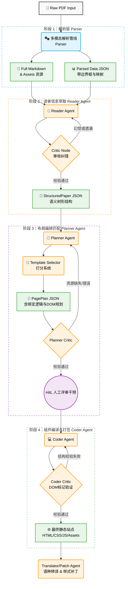

# PaperAlchemy ⚗️

基于多智能体协同的学术论文网页自动化构建系统  
*(Automated Paper-to-Page Construction based on Multi-Agent Collaboration)*

---

## 📖 项目简介

**PaperAlchemy** 旨在把静态的 PDF 学术论文“点石成金”，将其无缝转化为结构化数据，并全自动生成美观的、可交互的前端网页展示（Static Single Page Application）。

本项目目前已打通了完整的 **端到端工作流 (PDF → 结构化 JSON → 网页代码)**，融合了多模态大模型解析、精准的语义提取与可控的自动化排版能力，辅以 Human-in-the-Loop（人在回路）的可视化交互微调，为学术内容的现代化传播提供了一站式解决方案。

---

## 🌟 核心特性

- 📄 **多模态精准解析**：提取文字、表格、公式，并可携带基于原文绝对坐标的图片裁剪与映射。
- 🤖 **多智能体深度协同**：基于 LangGraph 编排的 Reader, Planner, Coder 等智能体各司其职，保证低幻觉与高还原度。
- 🎨 **智能模板匹配与组装**：系统自动给模板打分，支持排版引擎零代码（No-code）渲染并即时查阅。
- 🌍 **一键多语种与样式微调**：内置 Translator 与 Patch Agent 支持出海翻译和针对性样式热修复。
- 🖥️ **全托管透明工作台**：通过 Gradio 驱动的可视化工控台，人类可以监督、评审、随时干预核心决策节点。

---

## 🛠️ 技术栈全景图

| 模块 | 核心技术/框架 | 描述 |
| --- | --- | --- |
| **基础编排与调度** | **LangGraph** | 用于构建多智能体的有限迭代状态机、记忆 Checkpointing 与并发流转。 |
| **大模型（LLM/VLM）** | **Gemini 3 Pro / Flash** | 提供核心的推理、翻译、代码编写及视觉判定能力 (基于 `langchain_google_genai`)。 |
| **多模态文档解析** | **Docling** <br> **docling-core** | 强大的跨模态 PDF 解析器，负责 OCR、表格逻辑化提取及图像切片。 |
| **数据校验与防守** | **Pydantic** | 贯彻于全业务生命周期的数据 Schema 严格校验，防止长文解析幻觉。 |
| **Web交互与可视化** | **Gradio** <br> **Playwright** | Gradio 构建控制流 UI 界面；Playwright 作为服务端无头引擎，实现页面的秒级快照核验。 |
| **其他组件** | **BeautifulSoup4** | 用于 DOM 树查找及 HTML 代码组件的精细合并和修改。 |

---

## ⚙️ 架构与内部工作流 (WorkFlow)

PaperAlchemy 的管线设计高度解耦，各 Agent 根据 Actor-Critic（行动-评论）架构反复自省核验，直到满意再向下游流转。



### 深入解析各阶段核心逻辑

1. **PDF 解析管线 (Parser, `src/parser.py`)**：
   目标 PDF 被转换为结构化的 Markdown 及全页截图。提取单独的组件（图形、表格）并在带有绝对边界框的 JSON 中进行锚点坐标关联，为大模型提供精准的空间上下文关联。

2. **读者智能体阶段 (Reader Agent & Critic, `src/agent_reader*.py`)**：
   基于原文本与元数据 JSON，以 Actor-Critic（生成-评审）循环反复消化长文本论文。它负责从大文本中提取出明确格式的 `StructuredPaper` (Pydantic Schema)，包含：标题、摘要、作者及各级段落子对象。它的附属 `Critic Node` 将防范内容长度缺失与图像引用的幻觉。

3. **规划智能体阶段 (Planner Agent, `src/agent_planner*.py`)**：
   此智能体会生成 `SemanticPlan` 设计草案，并自动将其特征与内置预设 HTML 模板库（读取自 `tags.json` 的模版描述资产）进行智能打分匹配与排序。随后将语义设计严格绑定进最优模板结构内，输出 `PagePlan` 蓝图。在最终流转前，控制流允许用户在 GUI/CLI 上暂停触发 **HitL 人工评审干预**，进行组件调换与排版重组。

4. **编码智能体阶段 (Coder Agent, `src/agent_coder*.py`)**：
   一种稳定健壮的零代码引擎生成范式（非 LLM 续写整个混乱 HTML）。它严格根据 `PagePlan` 蓝图指示，复制静态模板对应的 CSS&JS 上下文环境；并将基于结构化大纲生成好的语义 `<body>` DOM 树代码精准注入到网页目标槽位中。最后，采用服务器后台无头渲染快照查验成型效果。

---

## 📂 项目目录结构概述

```text
PaperAlchemy/
  ├─ app.py                 # Gradio Web UI 主应用层，打通全量组件图谱与 HitL 阻断
  ├─ main.py                # 推荐启动入口 (实质为 app.py 执行器层封装)
  ├─ src/
  │   ├─ parser.py          # PDF 的底层多模态抽取工具链 (基于 Docling)
  │   ├─ agent_reader*.py   # Reader 阅读推导管线与判决器节点
  │   ├─ agent_planner*.py  # Planner 排版智能匹配引擎及 DOM 映射判定
  │   ├─ agent_coder*.py    # Coder 零代码安全无痛编译静态部署引擎 
  │   ├─ agent_patch.py     # Patch 补丁模块及 Translator 翻译辅佐等边缘智能体
  │   ├─ template_*.py      # Shell 渲染基类的 HTML 模板调度引擎组件
  │   ├─ llm.py             # Chat 底座模型分级下发及 API 认证连接池
  │   └─ schemas.py         # 论文结构/组件页面计划全局 Pydantic 数据抽象强基模型
  ├─ data/
  │   ├─ input/             # 用户侧置入待解析目标 PDF 靶向槽位
  │   └─ output/            # 工作流处理全生命周期中间物缓存落盘与最终站点产物
  ├─ workflow_analysis_cn.md# 极其详尽的一份内部系统端到端工作流解析与竞品对比架构报告
  └─ requirements.txt       # 项目 Python 依赖库指引列表
```

---

## 🚀 快速上手与部署指南

### 1. 环境准备与依赖安装
确保您预先持有 Python Conda 虚拟环境且已被激活。终端直接调用下述指令拉取相关组件支持：
```bash
pip install -r requirements.txt
```

*(必备服务端支持) Playwright 环境无头引擎初始化：*
为保障生成的网页能在后台被截取首屏快报快照进行评判，您必须自主初始化浏览器依赖内核机制：
```bash
playwright install chromium
```

### 2. 配置大语言模型凭据 (`.env`)
请在项目的物理根目录下复制或手动生成一份名为 `.env` 的隐私认证配置文件。将内侧所需要的 Gemini AI 凭据字段填入：
```env
# 获取你的开发者 Token: Google AI Studio
GOOGLE_API_KEY=修改为您的真实_gemini_api_key

# 代理配置（根据宿主机网络环境选填，如果不处于敏感环境亦可留空或注释）
HTTPS_PROXY=http://127.0.0.1:7890
```

### 3. 点火启动可视化控制台
在一切就绪后，在当前目录路径敲击入口指令拉起系统引擎服务：
```bash
python main.py
```
> 服务器日志刷新且绑定成功后，于自备的宿主浏览器上键入 `http://127.0.0.1:7860/` 以掌控全局。

**全托管交互步调基线体验流速：**
1. **输入投喂**：将需要转换成网页发布的测试学术论文 (.pdf) 丢挂入 `data/input` 生命周期管理槽位，UI 级便可自动追踪。
2. **约束宣发**：按个人美学和页面倾向设置期望：密集骨架或是空灵视觉，冷暖色调搭配。
3. **管线派发**：一键 Generate，端着咖啡监督后台 Reader/Planner 等各色 Agent 完成其流转交接工作。
4. **人工控制(HitL)**：在 Planner 环节组装结束将要切交由最终发包（部署前夕），系统会呈现其初步推演组件结果；你可以自由在此干预组件内容，拖移节点顺位或是切替指定要呈现的表单，随后批准放行。

---

## ✅ 建设路线图与进展 (Roadmap)

- [x] 基于 Docling 跨模态管线的全文本萃取与表图坐标切片精细化梳理对接
- [x] 基于类生逻辑 Actor-Critic 防丢反思机制的 Reader 智能体模型投产
- [x] 基于特征权重的模板排序适配方案及灵活组装节点块树的 Planner 上线
- [x] 全自动化 Coder 拼装模板并输出免部署包隔离依赖站点的底层硬编码实现
- [x] 涵盖工作流可视化回溯、日志追查及强阻断 HitL 工具链路的现代级 Gradio Hub 面板实装

---

*“Turn your intricate static papers into an interactive modern miracle.” — The PaperAlchemy Team*
