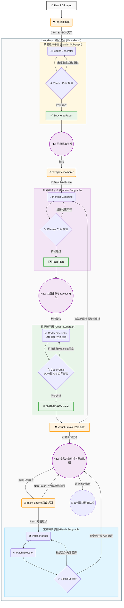

# PaperAlchemy ⚗️

基于多智能体协同的学术论文网页自动化构建系统  
*(Automated Paper-to-Page Construction based on Multi-Agent Collaboration)*

---

## 📖 项目简介

**PaperAlchemy** 旨在把静态的 PDF 学术论文“点石成金”，无缝转化为结构化数据，并全自动生成美观、可交互的学术前端网页展示（Static Single Page Application）。

本项目目前已经打通了高度细化的**端到端工作流 (PDF → 结构化 JSON → 智能模板编译 → 分块渲染 → 网页修订)**，在后台通过多模态大模型解析、精准语义提取与严谨的代码编译装配能力，极大地消除了长片段长文生成网页时的幻觉。加上贯穿始终的 Human-in-the-Loop（人在回路）监控及基于“意图引擎 (Intent Engine)”的局部安全打补丁机制，为您提供一站式学术内容多媒体化的最佳实践。

---

## 🌟 核心特性

- 📄 **多模态精准解析**：接管 Docling 处理管线，不仅提取纯文本，还能完整锚定表格与全页参考图像切割。
- 🤖 **多智能体深度协同**：依托 LangGraph 构建稳健的有限状态机架构，Reader、Planner、Coder 各个节点按契约严格流转业务逻辑。
- 🎨 **模板优先的组件级装配**：抛弃极高幻觉风险的全页代码无中生有，采用先进的模板探测与编译 (Template Compile) 以及块级独立组装引擎 (Block Render Spec)，将页面结构化绑定。
- 🌍 **意图驱动的原生局部修订**：不满意可随时对最终站点进行可视化局部微调。全新集成的 Intent Engine 与 Patch Pipeline 会精准地在网页对应 DOM 锚点上施加样式覆写与结构替换，而绝不会破坏整体架构。
- 🖥️ **全生命周期人工干预**：基于 Gradio 框架编织的可视化工控台，用户能在“大纲敲定前”、“网页板块拼装前 (Layout Compose)”与“终稿验收后”无缝介入甚至阻断工作流，完美把控业务表现边界。

---

## 🛠️ 技术栈全景图

| 模块 | 核心技术/框架 | 描述 |
| --- | --- | --- |
| **基础逻辑编排** | **LangGraph** | 提供高维度图论状态机的流程流转节点控制、Checkpoint 记忆与 HITL 断点管理。 |
| **多模态大模型** | **Gemini (支持 Vertex AI 优先验证)** | 依托 `langchain_google_genai` 提供文档抽取摘要、片段代码块编译生成、修改意图分类验证等。 |
| **PDF 解构抽取** | **Docling** | 全能的文档引擎，分离图文坐标，输出多模态解析资产缓存与全文本。 |
| **强类型流转校验** | **Pydantic** | 贯穿 Parser、Reader 到最终 Artifact 生命周期的数据边界限制模型，彻底隔离组件幻象。 |
| **图形终端与阅览** | **Gradio / Playwright** | Gradio 提供状态展示器面板，Playwright 用于服务端页面一键截屏快照验收 (Visual Smoke)。 |
| **网页微调打桩** | **BeautifulSoup4** | 在意图引擎确认指令后，依赖其提供精准 DOM 定点定位抽取方案或局部替换。 |

---

## ⚙️ 架构与内部工作流 (WorkFlow)

PaperAlchemy 的关键管线设计高度解耦并注重容错流。每个 Agent 主流程均配有基于 Actor-Critic（行动-评论）防丢反思机制的自检节点，系统确保数据符合下一流层边界时才持续调度发包流转。


```mermaid
graph TD
    classDef Input fill:#f9f9f9,stroke:#333,stroke-width:2px,color:#000;
    classDef Agent fill:#fff3e0,stroke:#ff9800,stroke-width:2px,color:#000;
    classDef Artifact fill:#e8f5e9,stroke:#4caf50,stroke-width:2px,color:#000;
    classDef HitL fill:#f3e5f5,stroke:#9c27b0,stroke-width:2px,color:#000;
    classDef SubGraph fill:none,stroke:#333,stroke-width:2px,stroke-dasharray: 5 5;

    A["📄 Raw PDF Input"]:::Input --> Parser("fa:fa-cogs 多模态解析"):::Agent
    Parser --> |"📝 MD & JSON资产"| R_Agent
    
    subgraph Main_LangGraph ["LangGraph 核心流图 (Main Graph)"]
        
        %% Reader Phase Subgraph
        subgraph SubGraph_Reader ["读者组件子图 (Reader Subgraph)"]
            R_Agent("🧠 Reader Generator")
            R_Critic{"🔍 Reader Critic校验"}
            R_Agent --> R_Critic
            R_Critic -- "未提取全/幻觉重试" --> R_Agent
            R_Critic -- "校验通过" --> R_End["✅ StructuredPaper"]:::Artifact
        end
        R_End --> HitL_Overview(("HitL: 前期萃取干预")):::HitL
        
        HitL_Overview -- "继续" --> T_Compile("⚙️ Template Compiler"):::Agent
        T_Compile --> |"📑 TemplateProfile"| P_Agent
        
        %% Planner Phase Subgraph
        subgraph SubGraph_Planner ["规划组件子图 (Planner Subgraph)"]
            P_Agent("🧭 Planner Generator")
            P_Critic{"🔍 Planner Critic校验"}
            P_Agent --> P_Critic
            P_Critic -- "组件约束不符" --> P_Agent
            P_Critic -- "校验通过" --> P_End["🗺️ PagePlan"]:::Artifact
        end
        
        P_End --> HitL_Outline(("HitL: 大纲评审与 Layout 介入")):::HitL
        HitL_Outline -- "组装授权" --> C_Agent
        
        %% Coder Phase Subgraph
        subgraph SubGraph_Coder ["编码器子图 (Coder Subgraph)"]
            C_Agent("💻 Coder Generator<br>分块重组/兜底整页")
            C_Critic{"🔍 Coder Critic<br>DOM结构与边界查验"}
            C_Agent --> C_Critic
            C_Critic -- "约束违背/Manifest异常" --> C_Agent
            C_Critic -- "验证通过" --> C_End["🌐 落地网页与Manifest"]:::Artifact
        end
        C_End --> VisualQA["👁️ Visual Smoke 视觉查验"]:::Agent
        
        VisualQA -- "如视觉崩溃需规划重排" --> P_Agent
        VisualQA -- "正常网页就绪" --> HitL_Webpage(("HitL: 视觉大端审视与防线拦截")):::HitL
        
        %% Revision Phase Subgraph
        HitL_Webpage -- "意图反馈录入" --> IE("🧩 Intent Engine 路由识别"):::Agent
        IE --> |"Non-Patch 不合规修饰打回"| HitL_Webpage
        
        IE --> |"Patch 意图继续"| Patch_Plan
        subgraph SubGraph_Patch ["定锚微调子图 (Patch Subgraph)"]
            Patch_Plan("🛠️ Patch Planner")
            Patch_Exec("⚙️ Patch Executor")
            Patch_Verify{"✅ Visual Verifier"}
            Patch_Plan --> Patch_Exec --> Patch_Verify
            Patch_Verify -- "微调注入失效回炉" --> Patch_Plan
        end
        
        %% 【优化点】：直接从内部校验节点输出
        Patch_Verify --> |"安全闭环写入存储层"| HitL_Webpage
        HitL_Webpage -- "最终落定满意" --> End(("🏁 交付最终形态站点"))
    end
    
    style Main_LangGraph fill:#fafafa,stroke:#78909c,stroke-width:2px;
    style SubGraph_Reader fill:#fff8e1,stroke:#ffe082,stroke-width:2px;
    style SubGraph_Planner fill:#f3e5f5,stroke:#e1bee7,stroke-width:2px;
    style SubGraph_Coder fill:#e8f5e9,stroke:#c8e6c9,stroke-width:2px;
    style SubGraph_Patch fill:#e1f5fe,stroke:#b3e5fc,stroke-width:2px;
```

### 深入解析各阶段核心逻辑

1. **PDF 解析与抽取层 (`src/parsing/`)**：
   原始 PDF 被安全提取转换为易于流转长文本读取的 Markdown 以及精准包含参考图像提取逻辑的组件表树特征 JSON。此项步骤能提前锁定全页截图和图表裁切范围与锚定坐标关联情况。

2. **读者结构化阶段 (`src/agents/reader.py`)**：
   该智能体会消费粗糙的 Markdown 并在后台剥离浓缩为极强树形结构约束的 `StructuredPaper` （摘要核心论断，各节独立分段等信息特征提取实体类）。此时系统已从冗余且不受序的纯文字过渡成数据库概念的数据记录链。Critic 环节自动检查提取是否存在篇幅遗漏跳页导致的大面断结缺失错误。

3. **智能排版编译规划阶段 (`src/template/` & `src/agents/planner.py`)**：
   引入全新的模板提前感知策略 (Template Compile)。不再依赖原始代码文本供大模型瞎猜排版范例结构，而是先独立抽出固定规范的数据视图映射特征 `TemplateProfile`。Planner Agent 根据目标匹配值将文档知识按块级细分开，映射在允许挂靠的安全组件区域 (Shell Candidates) 里，得出带有严格上下文装配关系的蓝图文件 `PagePlan` (取代废弃的 SemanticPlan)。后续也可自由开启 HitL 手动介入执行人工排版。

4. **实体编码与节点重组阶段 (`src/agents/coder.py`)**：
   该阶段核心采用业界领先稳定的 **块级编译重组策略 (Compiled Block Assembly)** (仅在遇到极高风险的不兼容模板时才调用 Legacy Fullpage 旧策略兜底保护)。针对之前派发明确的每一个分化小结指令单独利用并发或者顺序环境计算渲染局部代码切片后放入检验器，若安全，利用固定主干逻辑填埋入最终页面中，极度确保无安全泄露、无页面逻辑完全错乱幻觉产生。最终提现前留存带有数据源锚标记 (`data-pa-block`, `data-pa-slot`) 的追述文件 (Manifest)。

5. **意图微调引擎修订阶段 (`src/revision/` & `src/patching/`)**：
   淘汰掉老一代的笼统 Translator。利用强分级的**意图识别引擎 (Intent Engine)** 对最终网页不满意区域修改指令做分类。如判定为是针对特定按钮元素、色块底景等进行的微调修改或局部节点文本修饰，会进入 Patch 专用流程执行定距抽取打补丁作业。全程免除整页生成大模型重新刷新带来的性能噩耗和不可预期性，完全基于 DOM 注入改写操作刷新。

---

## 📂 项目目录结构概述

最新的系统架构实施了高度职能化拆解和分级隔离包部署（完全兼容对旧版本引入和现有全部功能栈的回溯适配）：

```text
PaperAlchemy/
  ├─ main.py                # 项目启动主执行器，推荐使用
  ├─ app.py                 # Gradio 工作流与外置兼容层门面配置 (Facade 封装入口层)
  ├─ requirements.txt       # Conda 依赖建议列表清单
  ├─ src/                   # 核心代码分层
  │   ├─ agents/            # 各主要流转核心调度处理智能体 (Reader / Planner / Coder 等)
  │   ├─ contracts/         # 项目级基础契约、跨阶段工作流状态容器与 Schema 定义汇聚
  │   ├─ parsing/           # 第三方提取外围库包裹逻辑或解析结果缓存落盘机制
  │   ├─ patching/          # 面向最后一步定距网页模板静态节点的补证外科手术执行者
  │   ├─ revision/          # 意图引擎控制中枢、反馈鉴权包构建识别与截屏查验证算系统
  │   ├─ services/          # 第三方 LLM 控制节点挂载调频支持及辅助硬盘保存系统
  │   ├─ template/          # 重点：模板静态解析层编译扫描缓存构建、插槽资源逻辑探测
  │   ├─ ui/                # 承载 Gradio 所有控制分块拆分装钉和页面后端事件拦截重构器
  │   ├─ workflows/         # 使用 LangGraph 框架构建工作流实体、路网挂接处理调度管线
  │   └─ utils/             # 无状态简单通用辅助逻辑
  ├─ data/
  │   ├─ input/             # 用户上传的原始待处理 PDF 默认抓放容器
  │   └─ output/            # 工作流内循环或中间产物监控、落盘编译库缓存与最后建站结果
  └─ tests/                 # 涵盖业务结构流图节点运转防退步、数据结构相容与单元验证测试用集
```

---

## 🚀 快速上手与部署指南

### 1. 环境准备与依赖安装
由于目前高度依赖了兼容底层组件库逻辑，本项目推荐且绑定操作环境于自带 Conda 环境层级验证配置中，暂不建议混搭隔离的新建虚拟虚拟依赖路径环境。激活 Conda 基础引擎配置环境后：
```bash
pip install -r requirements.txt
```

*(特别注意)* 为顺利让后台通过 Playwright 视觉审查机制来判断页面结果，首次配置阶段必须为本地下载浏览器渲染所需底层无头环境依赖机制包：
```bash
playwright install chromium
```

### 2. 配置大语言模型凭据 (`.env`)
由于目前核心模型算力依赖外调架构分派任务，请在项目根目录中自行手动新建一份 `.env` 文件。`.env` 或任何后缀包含权限 JSON 均不可提交入 Git 公共仓库暴露危险痕迹。当前已经成功全面打通多维 Gemini 系列大模型接入方式：

1. **Vertex AI Service Account JSON（主力验证与推荐）**
   此接入方式下允许享有更广范围响应带宽池。将本地具备云平台相应权力的 JSON 引入文件。当存有相关格式 JSON 时系统内层环境自动感知并越过默认校验走此链路（或借助下述参数直接引导）：
   ```env
   VERTEX_SERVICE_ACCOUNT_JSON=C:\path\to\your-service-account.json
   VERTEX_PROJECT=your-gcp-project-id
   VERTEX_LOCATION=global
   ```
   
2. **Google AI Studio API Key（历史遗留备灾回退路径）**
   系统只会在无可选 Vertex 配置前提下才会去拉取如下 Key：
   ```env
   GOOGLE_API_KEY=your_gemini_api_key
   ```
   
> *若正处于代理网关部署阻断情况非常规环境开发，可补配 `HTTPS_PROXY=http://127.0.0.1:xxxx` 或等效策略避免连线超时抛错。*

### 3. 点火启动可视化控制台
完成组件部署并放置好所需测试论文样本入对应的 Input 下后，切到根节点目录路径即可点火后台守护管理控制程序：
```bash
python main.py
```
> 后台环境会绑定挂载全部功能组件。打开本地浏览器地址跳转于 `http://127.0.0.1:7860/` 将正式开始全托管可视操纵台。

**端管线快速试飞行进节奏说明**：
1. **喂养输入**：先在根管理界面将指定的一份学术原文本文件挂接派发。
2. **初阶校验**：等待后端解拆报告，然后下达美学骨架倾向设置决定，在 Planner 产出时可直观预审分块结构，按需开启阻截功能手工进行更微观精准的分区重新连接组合。
3. **分装落定与成品交付修订**：允许其执行块组装成网页落盘过程。等待系统完成成品交付快照弹送时（此时界面会露出局部编辑指令输入卡）。只要指令合理合规在意图验证中被接收，系统立刻进行零页面干扰级的重入局部刷新回塞，直至效果完全对标期待。

---

## ✅ 建设路线图与进展 (Roadmap)

- [x] 解绑原有死板基于单一文本块大模型瞎猜排版的恶劣产出环境情况，推行并落实编译级隔离 **块装载机制 (Compiled Block Assembly)** 主体控制权与方案。
- [x] 解析组件全通管线：从底层对 Docling 解耦拆骨分离组件提取及加入 Actor-Critic 防偏节点拦截 Reader。
- [x] TemplateProfile 编译层预制构建完善，彻底完成前置解析脱虚向实，打碎并把控所有外部 UI 入口组件插槽契点与静态安全性核查。
- [x] 项目内嵌级业务领域解耦升级与大重构目录（分离归档出数十个对应垂直体系职能如 `contracts`、`patching`、`workflows` 与 `ui` 包装等结构面相）。
- [x] 将陈冗低辨识率泛滥的网页回炉修善 Translator 阶段全数彻底改道转写由新接线的核心 **Intent Engine** 作为统一代理和精准锚记靶标判定依据体系进行底层安全操戈控制逻辑替代处理落实施行。
- [ ] 后续对多语言或基于移动屏幕适配环境探索更多自建 Template Profiler 流动映射控制算法适配尝试与验证补充。

---

*“Turn your intricate static papers into an interactive modern miracle.” — The PaperAlchemy Team*
