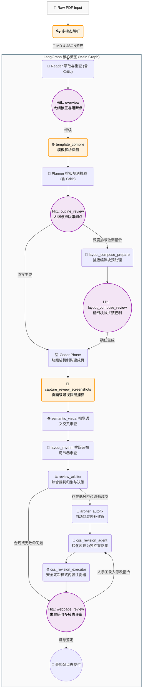

# PaperAlchemy ⚗️

基于多智能体协同的学术论文网页自动化构建系统  
*(Automated Paper-to-Page Construction based on Multi-Agent Collaboration)*

---

## 📖 项目简介

**PaperAlchemy** 旨在把静态的 PDF 学术论文“点石成金”，无缝转化为结构化数据，并全自动生成美观、可交互的学术前端网页展示（Static Single Page Application）。

本项目目前已经打通了高度细化的**端到端工作流 (PDF → 结构化 JSON → 智能模板编译 → 分块渲染 → 视觉机审与 CSS 级安全修订)**。在后台，通过多模态大模型解析、精准的语义提取、极其严谨的编译块级代码装配能力，以及自动化的网页多维度审视节点（视觉、排版节奏等），极大地消除了长文本转化网页时常见的“幻觉”。配合贯穿整个管线的 Human-in-the-Loop (HITL) 关键断点拦截监控，以及高度重构的全新 CSS 本地修订引擎 (CSS Revision Agent & Executor)，为您提供极为稳定的一站式学术内容多媒体化构建方案与工作体验。

---

## 🌟 核心特性

- 📄 **多模态精准解析**：深度挂载 Docling 解析管线，不仅完美提取文本语义段落，更能精准切割论文全页快照参考与独立的图表图片素材资产锚定。
- 🤖 **多智能体深度协同**：依托 LangGraph 编织的健壮有限状态机流图设计，将 Reader (信息萃取)、Planner (排版)、Coder (生成)、Review (视觉审阅) 与 Revision (修订) 各管线按确定性严格契约推进。
- 🎨 **模板优先的组件级装配**：摒弃存在高幻觉风险的大模型无限制零基础页面生成。直接通过先进的模板探测 (Template Compile) 与块级内容汇编引擎 (Compiled Block Assembly) 独立渲染结构化视图后填埋绑定到宿主模板的安全插槽区域。
- 🌍 **多层级视觉预审与 CSS 原生修订**：全新上线自动截图自修复流 (Arbiter Autofix) 和精确定距安全多层重刷引擎 (CSS Revision Agent & Executor)。从根本上替代了脆弱笼统的旧意图引擎机制。对于网页不满意区域，模型会且仅会利用纯 CSS 补丁 (`css_rules`) 和锚点片段替换 (`content_replacements`) 进行手术级局部刷新，规避重渲染带来的毁灭和污染。
- 🖥️ **全生命周期人工干预 (HitL)**：在 Gradio 构建的视图栈上，用户可在萃取大纲后 (Overview)、网页布局拼装微调前 (Layout Compose Review)、以及最后网页全景检查验收时 (Webpage Review) 随时阻断系统流图，执行微观控制、下发意见或强制阻断越权。

---

## 🛠️ 技术栈全景图

| 模块 | 核心技术/框架 | 描述 |
| --- | --- | --- |
| **基础逻辑编排** | **LangGraph** | 提供高维度图论状态机的流程流转节点控制、Checkpoint 记忆与 HITL 断点管理机制。 |
| **多模态大模型** | **Gemini (支持 Vertex AI 优先验证)** | 依托 `langchain_google_genai` 提供文档抽取摘要、方案决策推断、审查裁判决策以及 CSS 级修订计划的生成。 |
| **PDF 解构抽取** | **Docling** | 全能的开源文档引擎，精确分离图文包络坐标，抽取并输出多模态解析模型资产与全文本。 |
| **强类型流转校验** | **Pydantic** | 贯穿全工作流的命脉防线，从 Reader 的结构化结果至最终 Revision Plan 边界严防死守，彻底隔离组件幻象。 |
| **图形终端与阅览** | **Gradio / Playwright** | Gradio 提供整体业务展示控制台，Playwright 用于服务端运行时页面级快照的一键截取 (Visual Smoke) 向下流输送。 |
| **网页微调打桩** | **BeautifulSoup4** | 作为后端核心依赖，实现模板静态层探测架构解剖以及在 CSS 替换/局部落位时的安全定距抽换操作。 |

---

## ⚙️ 架构与内部工作流 (WorkFlow)

PaperAlchemy 使用 LangGraph 进行核心流转。最新修订的主系统管线涵盖五大核心分级阶段（阅读萃取、模式编译/排版规划、重组装配、机分重审与微调反思），并附带了高度解耦的微反馈闭环。


```mermaid
graph TD
    classDef Input fill:#f9f9f9,stroke:#333,stroke-width:2px,color:#000;
    classDef Agent fill:#fff3e0,stroke:#ff9800,stroke-width:2px,color:#000;
    classDef Artifact fill:#e8f5e9,stroke:#4caf50,stroke-width:2px,color:#000;
    classDef HitL fill:#f3e5f5,stroke:#9c27b0,stroke-width:2px,color:#000;
    classDef SubGraph fill:none,stroke:#333,stroke-width:2px,stroke-dasharray: 5 5;

    A["📄 Raw PDF Input"]:::Input --> Parser("fa:fa-cogs 多模态解析"):::Agent
    Parser --> |"📝 MD & JSON资产"| Reader_Phase
    
    subgraph Main_LangGraph ["LangGraph 核心流图 (Main Graph)"]
        
        %% Reader Phase
        Reader_Phase("🧠 Reader 萃取与重查 (含 Critic)")
        Reader_Phase --> HitL_Overview(("HitL: overview<br>大纲核正与阻断点")):::HitL
        
        %% Plan Phase
        HitL_Overview -- "继续" --> T_Compile("⚙️ template_compile<br>模板解析探测"):::Agent
        T_Compile --> Planner_Phase("🧭 Planner 排版规划校验 (含 Critic)")
        Planner_Phase --> HitL_Outline(("HitL: outline_review<br>大纲与排版审阅点")):::HitL
        
        %% Layout Compose
        HitL_Outline -- "深度排版微调指令" --> LC_Prep("📌 layout_compose_prepare<br>排版编辑块预处理")
        LC_Prep --> LC_Rev(("HitL: layout_compose_review<br>精细块状拼装控制")):::HitL
        
        %% Coder Phase
        HitL_Outline -- "直接生成" --> Coder_Phase("💻 Coder Phase<br>块组装机制构建成页")
        LC_Rev -- "确任生成" --> Coder_Phase
        
        %% Review & Arbiter Phase
        Coder_Phase --> Capture("📸 capture_review_screenshots<br>页面级可视快照捕获"):::Agent
        Capture --> RV_SemVis("👁️ semantic_visual 视觉语义交叉审查")
        RV_SemVis --> RV_Layout("📐 layout_rhythm 排版及布局节奏审查")
        RV_Layout --> Arbiter("⚖️ review_arbiter <br>综合裁判归集与决策")
        
        %% Revision Phase
        Arbiter -- "存在低风险必须修改项" --> Arbiter_Autofix("🔧 arbiter_autofix<br>自动封装修补建议")
        Arbiter_Autofix --> CSS_Agent("🤖 css_revision_agent<br>转化反馈为独立策略集")
        
        Arbiter -- "合规或无致命问题" --> HitL_Webpage(("HitL: webpage_review<br>末端验收多模态评审")):::HitL
        
        HitL_Webpage -- "人手工录入修改指令" --> CSS_Agent
        CSS_Agent --> CSS_Exec("⚙️ css_revision_executor<br>安全定距样式内容注剥器")
        CSS_Exec --> HitL_Webpage
        
        HitL_Webpage -- "满意落定" --> End(("🏁 最终站点态交付"))
    end
    
    style Main_LangGraph fill:#fafafa,stroke:#78909c,stroke-width:2px;
```

### 深入解析各阶段核心逻辑

1. **PDF 解析与抽取层 (`src/parsing/`)**：
   原始 PDF 通过集成管道无损转换，并提取为包含语义层次和分离表单的高可读 Markdown。独立裁切留存每一页图片内容特征以及精确到元素的参考图像包罗信息并写入暂存仓，供各级引擎按需即时索检获取。

2. **读者结构化阶段 (`src/agents/reader.py` 等)**：
   该智能体会消费底层 Markdown 在后台通过自检剥离出强实体结构边界 `StructuredPaper` （如摘要判断、核心研究块提取）。自带在内部环回防跳页截流的 Critic，一旦缺失逻辑或幻听内容会在闭环中不断重溯刷新，以确证底层建筑精准不可动摇。

3. **智能排版编译规划阶段 (`src/template/` & `src/agents/planner.py`等)**：
   全系统启用了更优秀的提前感知探测器库。直接跳脱死板模板，转从预定分析机制抽取特征并包装生成 `TemplateProfile` 传递。进而，通过核心 Planner 将各小结业务信息按最适合表现区域生成图纸契约（`PagePlan`）。现在支持中段加入强大的 `Layout Compose` 模式手工指定各区块插装的层叠先后视觉控制点。

4. **实体编码与节点重组阶段 (`workflows/coder_phase.py`与相关包群)**：
   全管线抛绝过往全整页面一次性出栈可能引起的代码极速崩裂灾害。实行强有力的 **板块编译与独立组装生成策略 (Compiled Block Assembly)** 方式，单独针对拆离好块落区调用处理计算与合法注入，依靠 `PageManifest` 定桩生成无污染的终端成果底牌页面文件。

5. **意图微调引擎修订阶段 (`src/review/` & `src/revision/`等)**：
   颠覆性重组，舍并旧式脆弱笼统整页重绘逻辑。改用强分类判定引擎与裁判分拣点相依运行体系。依靠 `capture_review_screenshots`、分维度的评论器汇总后传递到 `css_revision_agent` 中。针对任何不满要求该引擎转化生成纯粹基于原位特征修改补丁方案 (包含声明式样式改变 `CssRevisionRule` 及可置换碎化内嵌 `ContentReplacement` 块），经由最下游安全无侵入注入实施替换更新作业，规避整个链的死锁或者大翻车情况发生。

---

## 📂 项目目录结构概述

最新的系统架构执行了极严格且高度职能化的分离部署。保证内部合约防退步隔离以及清晰状态边界定义管理流：

```text
PaperAlchemy/
  ├─ main.py                # 项目守护执行与根网罗挂点启动服务组件核心
  ├─ app.py                 # Gradio 视图流程框架及各子流程分发点核心调用处 (Facade)
  ├─ requirements.txt       # Conda 项目组依赖声明列表
  ├─ src/                   # 系统代码级包树根节点
  │   ├─ agents/            # 早期的 LLM 逻辑决策 Agent 控制层与对应校验（Reader/Planner 等基干）
  │   ├─ contracts/         # 项目级基础契约、跨环节工作流业务实体类设计声明与状态定义汇集点
  │   ├─ parsing/           # 外挂第三方系统解析抽取逻辑包装实现体系及缓存预热管理
  │   ├─ patching/          # 面向页面生成管道层提供底层基于 DOM 合规重操作或者基础装配绑定的引擎
  │   ├─ review/            # 全新引入的自动化机器视检点与仲裁分理逻辑集 (提供截屏与多种 Critic)
  │   ├─ revision/          # 流图核心：多模态意图与强约束 CSS 修订计划安全提取执行管线处理包
  │   ├─ services/          # 无独立状态的数据基建支援、LLM 基座实例化挂入及图文反馈转译构建区
  │   ├─ template/          # 重点：基于代码前置特征检测与编译扫描解析器工具落点区域
  │   ├─ ui/                # 承前启后的独立界面控制块代码：管理 Gradio 全部生命防反击卡与刷新机制
  │   ├─ validators/        # Manifest 安全防脱敏重测与引用资源合法查体组件审计员
  │   ├─ workflows/         # 使用 LangGraph 基于 StateGraph 将上方全包组织拼合串线与挂钩执行引擎 (含批处理与断断机制)
  │   └─ utils/             # 一般性跨领域普通帮助执行子库方法
  ├─ data/
  │   ├─ input/             # PDF 未加工原始上传资料仓
  │   └─ output/            # 工作流一切间断临时性生成信息产存区及工程化网页落点仓展示服务区
  └─ tests/                 # 测试与防回填业务接口集成节点库
```

---

## 🚀 快速上手与部署指南

### 1. 环境准备与依赖安装
由于目前高度依赖了兼容底层组件运行架构与测试隔离要求，推荐将运行服务置于新建对应的 Conda 环境级别使用以杜绝各种脏状态混淆：
```bash
pip install -r requirements.txt
```

*(特别注意)* 为顺利启用核心视觉机审组件链去配合网页快照和断点人工复位视觉复查环节处理，初次时必须要下达执行命令拉取运行容器组件所依托对应内核：
```bash
playwright install chromium
```

### 2. 配置大语言模型凭据 (`.env`)
云端超大规模参数基座直接驱动此工作网，需在运行目录里配置私密环境挂靠凭据 (`.env`) 表述配置（切记该包严禁推送于各版本服务器历史）：

1. **Vertex AI Service Account JSON（主力验证与推荐部署做法）**
   此接入方式下运行流被极大保证带宽连线效率，有效应对大时耗流媒体或海量 PDF 分析等应用请求负载需求：
   ```env
   VERTEX_SERVICE_ACCOUNT_JSON=C:\path\to\your-service-account.json
   VERTEX_PROJECT=your-gcp-project-id
   VERTEX_LOCATION=global
   ```
   
2. **Google AI Studio API Key（历史常规请求挂载默认落底方法）**
   如若你无法配凑或非生产环境单纯仅用于极精简单一处理情况并配齐了网络顺畅环境可回填单密锁口：
   ```env
   GOOGLE_API_KEY=your_gemini_api_key
   ```
   
> *若正处于代理网关部署阻断情况非常规环境开发，可补配 `HTTPS_PROXY=http://127.0.0.1:xxxx` 或等效策略避免长连线超时报错闪退。*

### 3. 点火启动可视化控制台
组件就绪完成并放置需要被炼金的样板学术文档资料（例如 PDF 源文件）至对应的 `data/input` 之下区域时直接启动主进程守护：
```bash
python main.py
```
> 服务器在一切加载核验就位过后将启动全局工作环境视图供您的常规默认浏览器端接收使用，跳转指向通常会固定锁定于 `http://127.0.0.1:7860/`，随即宣告完全交付点火运营！

**端管线快速试飞行进节奏说明**：
1. **源头解析**：下拉或键入要求处理的目标论文项目输入文件名然后点选执行即可以挂接进入管网首班车。
2. **提炼与校验规划点拦截**：它会先行进入抽取引擎提炼章节文本交与你概审确认执行规划，继而它会向您推出 Layout 细度排版配置视图（您可以介入细调每个被提取模块的先后逻辑位置呈现规则或图组挂载位置策略），随后您就可以敲下回车载入真正的代码成片处理逻辑里。
3. **分装落定与定距重审机制 (HitL 介入极微调)**：等到系统生成好初步效果通过审阅器快照回传屏幕展示出全部成果之后，界面末端将留有可执行调整挂点意图的指令块。若出现比如某区块间距有欠缺或者需要词句的直白改写您只需要把期望文字录入提交。`CSS Revision Executor` 即会在不动主基骨底气层上秒更效果以达最高审美意向！

---

## ✅ 建设路线图与进展 (Roadmap)

- [x] 解绑原有死板基于单一文本块大模型瞎猜排版的恶劣产出环境情况，推行并落实编译级隔离 **块装载机制 (Compiled Block Assembly)** 主体控制权与方案。
- [x] 解析组件全通管线：从底层对 Docling 解耦拆骨分离组件提取及加入 Actor-Critic 防偏节点拦截 Reader。
- [x] TemplateProfile 编译层预制构建完善，彻底完成前置解析脱虚向实，打碎并把控所有外部 UI 入口组件插槽契点与静态安全性核查。
- [x] 项目内嵌级业务领域解耦升级与大重构目录（分离归档出数十个对应垂直体系职能如 `contracts`、`patching`、`workflows` 与 `ui` 包装等结构面相）。
- [x] 淘汰低辨识率的旧版 Translator 与 Intent Engine，全面上线全新整合的多模态 **CSS 级修订引擎 (CSS Revision Agent & Executor)**，精准基于 DOM 产出带有目标锚点的 CSS 规则与局部内容片段置换 (Content Replacement)，确立绝对安全的修订生命周期闭环。
- [ ] 后续对多语言或基于移动屏幕适配环境探索更多自建 Template Profiler 流动映射控制算法适配尝试与验证补充。

---

*“Turn your intricate static papers into an interactive modern miracle.” — The PaperAlchemy Team*
