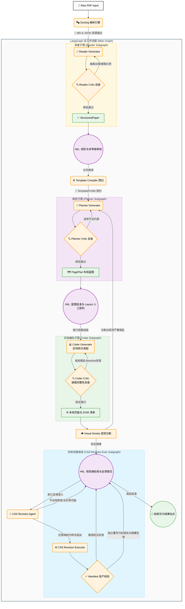

# PaperAlchemy ⚗️

基于多智能体协同的学术论文网页自动化构建系统  
*(Automated Paper-to-Page Construction based on Multi-Agent Collaboration)*

---

## 📖 项目简介

**PaperAlchemy** 旨在把静态的 PDF 学术论文“点石成金”，无缝转化为结构化数据，并全自动生成美观、可交互的学术前端网页展示（Static Single Page Application）。

本项目目前已经打通了高度细化的**端到端工作流 (PDF → 结构化 JSON → 智能模板编译 → 分块渲染 → CSS 级网页微调修订)**。抛弃了过去老旧的粗犷翻译与危险的 DOM 重建架构，当前后台依靠 `Compiled Block Assembly (基于预编译插槽的区块重组)` 取代了极易产生幻觉的长文本整页直接生成。系统完全实现了基于严格控制器的局部分块排版，且在生成后交付 **CSS Revision Agent** 机制进行无需破坏 DOM 的视觉微调打补丁操作。配合贯穿阶段节点处的 Human-in-the-Loop（人在回路）监控审查系统，为您提供一站式、零前端基础的学术多媒体化建站实践。

---

## 🌟 核心特性

- 📄 **多模态精准解析抽象**：基于底层 Docling 管道并包装出了一套组件解析方法，既提取格式化段落，又能在二维平面切割保留并缓存具有精确坐标参考系的表格和图集。
- 🤖 **精密的图与子图架构 (LangGraph)**：系统设计依托强状态机图集实现。不仅仅是流转，更细化到每个特定周期由 `Agent Generator` 与对应的 `Critic 校验审查节点` 构成了无限轮转直到通过才能进入下一阶段的自省反馈回路。
- 🎨 **模板编译优先的极控装配**：终结原版的瞎猜组件！通过在核心流程前置搭载由自动化跑测探明可用参数的 `Template Compiler` 预建出强类型的 `TemplateProfile`，以此约束 Planner 蓝图。后续由基于区块逻辑的装配工将计算结果无缝拼合。
- 🌍 **零侵入纯 CSS 修订模式 (CSS Revision)**：对产出网页仍存美学定见？无需回炉重造全站结构。当前迭代已彻底换装无幻觉危险的 **CSS Revision (CSS样式追加覆盖)**。系统直接从源发部位推导局部 HTML 精准覆写或提取 CSS Class 追加进入 Head 级内联覆盖渲染，安全迅捷。
- 🖥️ **全托管的阻断监控台**：依托极度适配 LangGraph 的 UI 层处理拦截，无论在大纲草案编排、版式手工映射 (Layout Compose) 亦或是结尾最终交付品打样时，皆存有允许人类干涉接管决策权力的控制点卡点记录。

---

## 🛠️ 技术栈全景图

| 模块 | 核心技术/框架 | 描述 |
| --- | --- | --- |
| **基础图论调度管理** | **LangGraph** | 用于实现拥有 `Main Graph` 与各个阶段 `SubGraph` 包裹、以及携带断点 Checkpoint 高级图记忆逻辑运行网络。 |
| **大规模多模态模型** | **Gemini (推崇 Vertex AI 版)** | 提供自然语言提取、编译节点组件以及转化人类样式修正反馈为合规 `CssRevisionPlan` 实体的数据中枢核心。 |
| **原始 PDF 多元解构** | **Docling** | 全能跨模态引擎，分离视觉元素切片，输出用于阅读分析的基础 MarkDown 书本。 |
| **管线协议校验封锁** | **Pydantic** | 在节点交互中贯彻数据生命周期的安全验证对象，从草稿规划直至终态修改追踪清单，全方位防越出。 |
| **终端展现域与截屏** | **Gradio / Playwright** | Gradio 生成交互阻截状态面台，Playwright 用于在不可视后端一键高速捕捉渲染定版或进行页面烟雾打回测试诊断 (Visual Smoke Report)。 |
| **安全结构切改操作** | **BeautifulSoup4** | 在 `CSS Revision Executor` 接受样式替换指令时操纵修改目标页 DOM 分子节点的特定 HTML Slot。 |

---

## ⚙️ 架构与内部工作流 (WorkFlow)

PaperAlchemy 的最新流线抛弃了平面型黑盒状态，实施了清晰划分的 LangGraph 结构封装与自校验回滚防抖控制：


```mermaid
flowchart TD
    classDef Input fill:#f9f9f9,stroke:#333,stroke-width:2px,color:#000;
    classDef Agent fill:#fff3e0,stroke:#ff9800,stroke-width:2px,color:#000;
    classDef Artifact fill:#e8f5e9,stroke:#4caf50,stroke-width:2px,color:#000;
    classDef HitL fill:#f3e5f5,stroke:#9c27b0,stroke-width:2px,color:#000;
    classDef SubGraph fill:none,stroke:#333,stroke-width:2px,stroke-dasharray: 5 5;

    A["📄 Raw PDF Input"]:::Input --> Parser("fa:fa-cogs Docling 解析引擎"):::Agent
    
    Parser --> |"📝 MD & JSON 资源锚点"| R_Agent
    
    subgraph Main_LangGraph ["LangGraph 总工作流图 (Main Graph)"]
        
        subgraph SubGraph_Reader ["读者子图 (Reader Subgraph)"]
            R_Agent("🧠 Reader Generator"):::Agent
            R_Critic{"🔍 Reader Critic 自查"}:::Agent
            R_Agent --> R_Critic
            R_Critic -- "抽取出错/提取幻觉" --> R_Agent
            R_Critic -- "核验通过" --> R_End["✅ StructuredPaper"]:::Artifact
        end
        
        R_End --> HitL_Overview(("HitL: 初阶文本萃取审核")):::HitL
        HitL_Overview -- "允许继续" --> T_Compile("⚙️ Template Compiler 预扫"):::Agent
        
        T_Compile --> |"📑 TemplateProfile 契约"| P_Agent
        
        subgraph SubGraph_Planner ["规划子图 (Planner Subgraph)"]
            P_Agent("🧭 Planner Generator"):::Agent
            P_Critic{"🔍 Planner Critic 自查"}:::Agent
            P_Agent --> P_Critic
            P_Critic -- "违背节点约束" --> P_Agent
            P_Critic -- "核验通过" --> P_End["🗺️ PagePlan 布局蓝图"]:::Artifact
        end
        
        P_End --> HitL_Outline(("HitL: 蓝图批准与 Layout 人工排列")):::HitL
        
        HitL_Outline -- "放行挂载组装" --> C_Agent
        
        subgraph SubGraph_Coder ["实体编码子图 (Coder Subgraph)"]
            C_Agent("💻 Coder Generator<br>区块拆分装配"):::Agent
            C_Critic{"🔍 Coder Critic<br>装载完整性自查"}:::Agent
            C_Agent --> C_Critic
            C_Critic -- "结构错乱/Manifest异常" --> C_Agent
            C_Critic -- "验证通过" --> C_End["🌐 本地页面与 DOM 清单"]:::Artifact
        end
        
        C_End --> VisualQA["👁️ Visual Smoke 视觉诊断"]:::Agent
        
        VisualQA -- "诊断出视觉严重错乱" --> P_Agent
        VisualQA -- "安全就绪" --> HitL_Webpage(("HitL: 视觉端检视与反馈提交")):::HitL
        
        HitL_Webpage -- "修订反馈录入" --> CSS_Agent("🎨 CSS Revision Agent"):::Agent
        
        CSS_Agent --> |"不合规修改/无补修可能"| HitL_Webpage
        
        CSS_Agent --> |"合规映射为样式追加"| Patch_Exec
        
        subgraph SubGraph_Patch ["仅样式微调流 (CSS Revision Exec Subgraph)"]
            Patch_Exec("⚙️ CSS Revision Executor"):::Agent
            Patch_Verify{"✅ Manifest 资产校验"}:::Agent
            Patch_Exec --> Patch_Verify
            Patch_Verify -- "微调验证失效" --> HitL_Webpage
        end
        
        Patch_Verify --> |"独立覆写代码或定点插槽生效"| HitL_Webpage
        HitL_Webpage -- "成品批准" --> End(("🏁 结束交付成果站点")):::Artifact
    end
    
    style Main_LangGraph fill:#fafafa,stroke:#546e7a,stroke-width:2px;
    style SubGraph_Reader fill:#fff8e1,stroke:#ffe082,stroke-width:2px;
    style SubGraph_Planner fill:#f3e5f5,stroke:#e1bee7,stroke-width:2px;
    style SubGraph_Coder fill:#e8f5e9,stroke:#c8e6c9,stroke-width:2px;
    style SubGraph_Patch fill:#e1f5fe,stroke:#b3e5fc,stroke-width:2px;
```

### 深入解析各阶段核心逻辑

1. **多模原始数据处理 (`src/parsing/parser.py`)**：
   借助 Docling 将学术原卷结构化提炼出一份 Markdown 内容。核心是在此时保留页面的切割快照，锁定图集及组件化数据的几何坐标索引。此处理将成为模型分析数据位置边界事实的铁证。

2. **核心阅读与提炼子层 (`src/agents/reader.py` & `reader_critic.py`)**：
   该级子图内部构建出闭环的阅读萃取回路。消费 Markdown 生成受制于严谨分块逻辑树形结构定义的对象 `StructuredPaper` （如独立提炼论点论据、独立标注引图源等）。通过内部自反馈 Critic 对生成的概要实行比对，预防信息缺失导致的数据损失悲剧发生再进行流转。

3. **智能合约规划子层 (`src/template/` & `src/agents/planner.py`)**：
   引入了重要的 **Template Compiler** 节点前置流程。此模块独立将外部网页模板中暴露的安全占位元素、可调整层解析出来生成 `TemplateProfile` 清单数据绑定参考依据。随后流转进入规划子图根据模板可负载容量，规划好内容安插的 `PagePlan` 映射指示集并可阻断进入界面呈现等待审批。（*由于该流程逻辑更稳健，遗留的无依托猜想构建版本 `SemanticPlan` 已被废弃淘汰*）。

4. **安全分块渲染组装子层 (`src/agents/coder.py`)**：
   当前最为主旋律的渲染核心执行方式转变为高容错保障的 **Compiled Block Assembly (定槽插拔编译策略)**（非极特殊状况拒绝采用原始黑盒的整页暴力大语言无规划重写兜底）。Coder 会极其克制地只在批准通过的蓝图组件内，单独渲染区块对应的 Html 片段，用内部规范代码严格校验插入原始空壳模版的位置。产出站点同时必定伴随提供一份带有精准查询标签的 `PageManifest` 路由索引器以供后链路随时溯洄追踪。且流转出来后必须过核心的 Playwright **Visual Smoke（视觉烟雾测）** 防护卡点，一有崩溃迹象果断打回 Planner 重新组排。

5. **无损层叠修补样式流转子层 (`src/revision/css_revision.py`)**：
   废除曾经臃肿高风险重编译 Intent Engine 修补全站操作及动辄引起 HTML DOM 大规模重写导致的二次连锁幻觉。现在修订链完全向更符合前端特性的**样式的非侵入覆盖机制 (CSS Revision Agent)** 转型：通过对用户发来的界面美化不满或颜色诉求进行意图识别转换（也包含非常针对性的插语替换）。转换后的实体指令通过 Executor 精准查找之前留存的 Manifest 所绑锚点并在该节点打入 `StyleChange` 结构覆写（于 Head 前置额外注入 `CssRevisionRule`），保证原始底层主体 HTML 树与骨干组件分毫不差安全留存。

---

## 📂 项目目录结构概述

项目执行了深层次物理分离并实施了规范的代码安全与子功能区域解耦：

```text
PaperAlchemy/
  ├─ main.py                # 项目常规安全入口引擎启动层
  ├─ app.py                 # Gradio 仅做主流程控制板拦截与基础图流转挂接声明 (门面外壁呈现 Facade)
  ├─ requirements.txt       # Conda 系统专属组件要求构建列表
  ├─ src/                   # 真正的功能引擎核心驱动库层次
  │   ├─ agents/            # 各主图区域 Generator/Critic AI 处理智囊簇 (Reader / Planner / Coder 等)
  │   ├─ contracts/         # 项目严苛生命校验实体池 (State 定义、Schema 安全阀)
  │   ├─ parsing/           # Parser 包裹外调层解析机制体
  │   ├─ patching/          # 面向修改目标的实际替换或内嵌应用执行方法管链
  │   ├─ revision/          # 专注对人类视觉反馈向安全的纯代码格式转换 CSS 的翻译处理核中枢 (原 Intent 被 CSS Revision 代替)
  │   ├─ services/          # Gemini API 对接封装防抛错与制品缓存存储辅助操作件
  │   ├─ template/          # 前置核心探针模块，执行前端空壳静态分析，自动打标安全插槽边界构建模板约束模型
  │   ├─ ui/                # UI 分包挂载件 (大纲审批件、版式重构卡点处理等独立前端更新管理)
  │   ├─ workflows/         # 使用 LangGraph 组件构造的主体控制路线连通节点配置组 (HitL graph等)
  │   └─ utils/             # 无副作用方法公用集
  ├─ data/
  │   ├─ input/             # 人类操作侧存放 PDF 源流待办文档区
  │   └─ output/            # 工作流中间过程核验日志落盘区域与 Web 成功站点缓存目录落脚处
  └─ tests/                 # 严苛的保证兼容包接线正常并保护核心算法防衰退全集测试套件
```

---

## 🚀 快速上手与部署指南

### 1. 环境准备与依赖安装
基于目前复杂的页面自动化快照截听校验需要，请于本项目的内置原生 Conda 环境下应用验证操作，以免引起沙盒外组件关联断层依赖出错：
```bash
pip install -r requirements.txt
```

*(底层引擎特别注意)* 您的计算机务必需配备了提供后端虚拟呈现截屏功能的内核驱动。首装必须执行如下代码使其拉取受支持组件（否则工作流将陷入查验失败死胡同）：
```bash
playwright install chromium
```

### 2. 配置大语言模型凭据 (`.env`)
由于计算环节剥离交给强大的大语言能力供给层管理，请自行在项目顶端根目录构造专属环境变量记录仪 `.env`（*包含机密，不要意外并入您的公共代码分支历史*）。项目当前已完善切换接驳处理两大官方验证端链路系统：

1. **推荐并自识别核心支持路线：Vertex AI Service Account JSON**
   通过传入持有鉴权证书的有效密钥格式文件打通更高级的平台对接并发授权通道。只要目录检索中呈现此内容或强加上下文指引，环境会绕过传统授权走高效验证链路：
   ```env
   VERTEX_SERVICE_ACCOUNT_JSON=C:\path\to\your-service-account.json
   VERTEX_PROJECT=your-gcp-project-id
   VERTEX_LOCATION=global
   ```
   
2. **保守传统开发向后兼容后备路线：Google AI Studio API Key**
   当缺失高效组件判定后才会触发旧世代参数调用：
   ```env
   GOOGLE_API_KEY=your_gemini_api_key
   ```
   
> *处于高阻抗封锁网关进行本地直调的开发受限网络可以自由补全如 `HTTPS_PROXY=http://127.0.0.1:xxxx` 实现转发破网操作控制权。*

### 3. 点火启动可视化控制台
组件检验搭建完成，您即可无痛唤入这套基于节点控制的页面孵化控制中极台引擎：
```bash
python main.py
```
> 控制终端将返回本地端口链接，进入熟悉的浏览器窗口打开 `http://127.0.0.1:7860/` 将体验所有操作管理视界。

**全通跑图实感干预节拍指导**：
1. **喂养分析源**：向项目预留地置入待解决处理 PDF 全稿发配挂载请求指令。
2. **校验图纸大纲干预**：经过预审后端剥离成果及选配对应视觉模板模型库基架。若认为不满意则手动卡点启用编织组件布局调整 (Layout Compose) 控制大方向内容分槽点。
3. **出成品审阅 CSS 追改**：任其下沉落成实际物理站点页面并完成自检验后，对最后生成的交互前端执行外观质检。对任何色彩比例元素在卡点进行“提出修订框诉求”，看着它利用无伤原组件机制直接追加修缮。

---

## ✅ 建设路线图与进展 (Roadmap)

- [x] 多模层底层引入并封装 Docling 技术引擎成功落地。内部组网自闭环带有打回特征保护隔离特性的 Actor-Critic 监督模式。
- [x] TemplateCompile 特性节点已加入工作流前置图核心。抛弃不可控的大片段无限制生搬硬造，实装受控的模版静态分析边界安全槽特征校验。
- [x] Coder 层级全面接替切换采用更加无风险隔离性较强的 **Compiled Block Assembly (分区插座重叠装插机制)** 以彻底制约系统 HTML 内容篡写重排危机问题。
- [x] 成功解除冗余危险代码结构层耦合隐疾。拆分落地实现业务代码功能解耦架构迁移化重构（如独立割裂 `workflows`, `contracts`, `ui`）。
- [x] 对最后修缮工作环实现由旧时代 `Translator`/`Intent` 等等危重新建引擎，彻底升级接续变更为最前沿安全的轻小量纯内联样式覆盖追踪层级：**CSS Revision 流水线处理架构**。
- [ ] 未来的移动触控兼容与多种族模板结构图自动化预测响应拓展性打版兼容方案探索支撑补充尝试。

---

*“Turn your intricate static papers into an interactive modern miracle.” — The PaperAlchemy Team*
