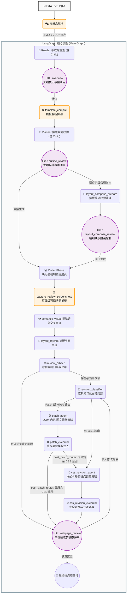

# PaperAlchemy ⚗️

基于多智能体协同的学术论文网页自动化构建系统  
*(Automated Paper-to-Page Construction based on Multi-Agent Collaboration)*

---

## 📖 项目简介

**PaperAlchemy** 旨在把静态的 PDF 学术论文“点石成金”，无缝转化为结构化数据，并全自动生成美观、可交互的学术前端网页展示（Static Single Page Application）。

本项目目前已经打通了高度细化的**端到端工作流 (PDF → 结构化 JSON → 智能模板编译 → 模板引导全页生成 → 多维视觉机审与双轨安全修订)**。在后台，通过多模态大模型解析、精准的语义提取、极其严谨的编译块级代码装配能力，以及自动化的网页多维度审视节点（视觉、排版节奏等），极大地消除了长文本转化网页时常见的“幻觉”。配合贯穿整个管线的 Human-in-the-Loop (HITL) 关键断点拦截监控，以及由 `revision_classifier` 驱动的全新**双轨修订引擎 (Patch & CSS Revision Engine)**，为您提供极为稳定的一站式学术内容多媒体化构建方案与工作体验。

---

## 🌟 核心特性

- 📄 **多模态精准解析**：深度挂载 Docling 解析管线，不仅完美提取文本语义段落，更能精准切割论文全页快照参考与独立的图表图片素材资产锚定。
- 🤖 **多智能体深度协同**：依托 LangGraph 编织的健壮有限状态机流图设计，将 Reader (信息萃取)、Planner (排版)、Coder (生成)、Review (多维审阅) 与 Revision (分类修订) 各管线按确定性严格契约推进。
- 🎨 **基于模板的前端组装**：摒弃存在高幻觉风险的大模型无限制零基础页面生成。直接通过先进的模板探测 (Template Compile) 与模板引导全页策略 (`template_guided_fullpage`) 进行渲染，同时底层保留块级汇编 (Compiled Block Assembly) 的扩展能力，确保无缝绑定到宿主模板的安全插槽区域。
- 🌍 **双轨机审与局部无感修复机制**：全新上线意图分类器 (`revision_classifier`)，自动将审查节点 (`Arbiter`) 缺陷或用户意见判定为 `Patch` (DOM内容修补) 或 `CSS` (样式与间距优化) 路线，甚至混合执行 (`Mixed`)。分别由对应 Executor 进行安全原位片段替换，彻底告别旧式整页重绘带来的崩溃灾难与样式污染。
- 🖥️ **全生命周期人工干预 (HitL)**：在 Gradio 构建的视图栈上，用户可在萃取大纲后 (Overview)、排版预规划后 (Outline Review/Layout Compose)、以及最后网页全景检查验收时 (Webpage Review) 随时阻断系统流图，执行微观控制、下发意见或强制阻断越权。

---

## 🛠️ 技术栈全景图

| 模块 | 核心技术/框架 | 描述 |
| --- | --- | --- |
| **基础逻辑编排** | **LangGraph** | 提供高维度图论状态机的流程流转节点控制、Checkpoint 记忆与 HITL 断点管理机制。 |
| **多模态大模型** | **Gemini (支持 Vertex AI)** | 依托 `langchain_google_genai` 提供文档抽取摘要、方案决策推断、审查裁判决策以及双轨修订计划的生成。 |
| **PDF 解构抽取** | **Docling** | 全能的开源文档引擎，精确分离图文包络坐标，抽取并输出多模态解析模型资产与全文本。 |
| **强类型流转校验** | **Pydantic** | 贯穿全工作流的命脉防线，从 Reader 结构化结果至 Revision/Patch 边界严防死守，彻底隔离组件幻象。 |
| **图形终端与阅览** | **Gradio / Playwright** | Gradio 提供整体业务展示控制台，Playwright 用于服务端运行时页面级快照的一键截取向下流输送。 |
| **网页微调打桩** | **BeautifulSoup4** | 后端核心依赖，实现模板探测架构解剖，以及在 Patch / CSS 意图路由时的安全定距 DOM 抽换操作。 |

---

## ⚙️ 架构与内部工作流 (WorkFlow)

PaperAlchemy 使用 LangGraph 进行核心流转。最新修订的主系统管线涵盖五大核心分级阶段（阅读萃取、模式编译/排版规划、重组装配、机分重审与双轨反思分类），并附带了高度解耦的微反馈闭环。


```mermaid
graph TD
    classDef Input fill:#f9f9f9,stroke:#333,stroke-width:2px,color:#000;
    classDef Agent fill:#fff3e0,stroke:#ff9800,stroke-width:2px,color:#000;
    classDef Artifact fill:#e8f5e9,stroke:#4caf50,stroke-width:2px,color:#000;
    classDef HitL fill:#f3e5f5,stroke:#9c27b0,stroke-width:2px,color:#000;
    classDef SubGraph fill:none,stroke:#333,stroke-width:2px,stroke-dasharray: 5 5;

    A["📄 Raw PDF Input"]:::Input --> Parser("fa:fa-cogs 多模态解析"):::Agent
    Parser --> |"📝 MD & JSON资产"| Reader_Phase
    
    subgraph Main_LangGraph ["LangGraph 核心流图 (Main Graph)"]
        
        %% Reader Phase
        Reader_Phase("🧠 Reader 萃取与重查 (含 Critic)")
        Reader_Phase --> HitL_Overview(("HitL: overview<br>大纲核正与阻断点")):::HitL
        
        %% Plan Phase
        HitL_Overview -- "继续" --> T_Compile("⚙️ template_compile<br>模板解析探测"):::Agent
        T_Compile --> Planner_Phase("🧭 Planner 排版规划校验 (含 Critic)")
        Planner_Phase --> HitL_Outline(("HitL: outline_review<br>大纲与排版审阅点")):::HitL
        
        %% Layout Compose
        HitL_Outline -- "深度排版微调指令" --> LC_Prep("📌 layout_compose_prepare<br>排版编辑块预处理")
        LC_Prep --> LC_Rev(("HitL: layout_compose_review<br>精细块状拼装控制")):::HitL
        
        %% Coder Phase
        HitL_Outline -- "直接生成" --> Coder_Phase("💻 Coder Phase<br>块组装机制构建成页")
        LC_Rev -- "确任生成" --> Coder_Phase
        
        %% Review & Arbiter Phase
        Coder_Phase --> Capture("📸 capture_review_screenshots<br>页面级可视快照捕获"):::Agent
        Capture --> RV_SemVis("👁️ semantic_visual 视觉语义交叉审查")
        RV_SemVis --> RV_Layout("📐 layout_rhythm 排版节奏审查")
        RV_Layout --> Arbiter("⚖️ review_arbiter <br>综合裁判归集与决策")
        
        %% Revision Phase
        Arbiter -- "存在必须修改项" --> Classifier("🧭 revision_classifier<br>双轨修订意图分类器")
        Arbiter -- "合规或无致命问题" --> HitL_Webpage(("HitL: webpage_review<br>末端验收多模态评审")):::HitL
        
        HitL_Webpage -- "录入修改指令" --> Classifier
        
        Classifier -- "Patch 或 Mixed 路由" --> Patch_Agent("🛠️ patch_agent<br>DOM 内容/图文修复策略")
        Patch_Agent --> Patch_Exec("⚙️ patch_executor<br>结构层替换与注入")
        
        Patch_Exec -- "post_patch_router: 无残余 CSS 意图" --> HitL_Webpage
        Patch_Exec -- "post_patch_router: 传递残余 CSS 意图" --> CSS_Agent("🤖 css_revision_agent<br>样式与局部锚点调整策略")
        
        Classifier -- "纯 CSS 路由" --> CSS_Agent
        CSS_Agent --> CSS_Exec("⚙️ css_revision_executor<br>安全定距样式注剥器")
        CSS_Exec --> HitL_Webpage
        
        HitL_Webpage -- "满意落定" --> End(("🏁 最终站点态交付"))
    end
    
    style Main_LangGraph fill:#fafafa,stroke:#78909c,stroke-width:2px;
```

### 深入解析各阶段核心逻辑

1. **PDF 解析与抽取层 (`src/parsing/`)**：
   原始 PDF 通过集成管道无损转换，并提取为包含语义层次和分离表单的高可读 Markdown。独立裁切留存每一页图片内容特征以及精确到元素的参考图像包罗信息并写入暂存仓，供各级引擎按需即时索检获取。

2. **读者结构化阶段 (`src/agents/reader.py` 等)**：
   该智能体会消费底层 Markdown 在后台通过自检剥离出强实体结构边界 `StructuredPaper` （如摘要判断、核心研究块提取）。自带在内部环回防跳页截流的 Critic，一旦缺失逻辑或幻听内容会在闭环中不断重溯刷新，以确证底层建筑精准不可动摇。

3. **智能排版编译规划阶段 (`src/template/` & `src/agents/planner.py`等)**：
   全系统启用了提前感知探测器库，直接跳脱死板模板，转从预定分析机制抽取特征并包装生成 `TemplateProfile` 传递。进而通过核心 Planner 将各小结业务信息按最适合表现区域生成图纸契约（`PagePlan`）。提供强大的 `Layout Compose` 模式，供人工手动指定各区块视觉层叠先后顺序。

4. **实体编码与节点重组阶段 (`src/workflows/hitl_nodes.py`与相关包群)**：
   全管线抛绝过往全整页面一次性出栈引起的代码灾难。目前系统核心主线默认运用稳健的 **模板引导全页生成策略 (`template_guided_fullpage`)**，同时架构层继续保持着对原始板块独立组装策略 (`Compiled Block Assembly`) 的分发能力，依靠 `PageManifest` 定桩生成无污染的终端底层页面。

5. **机审与双轨修订引擎阶段 (`src/review/` & `src/revision/`与 `src/patching/`)**：
   重构旧式脆弱整页重绘逻辑。引入 `capture_review_screenshots`、分维度的视觉评论器汇集到 `Arbiter`。通过智能路由分流器 (`revision_classifier`)，精准分析缺陷属于 **内容/图文重绑定需求 (Patch Route)** 还是 **视觉样式调整需求 (CSS Route)**。基于顺序路由决策机制流式推导至对应专精引擎（如 `Mixed` 模式下先走 `patch_agent` 修补结构，再由 `post_patch_router` 判断是否需要传递给 `css_revision_agent` 继续打补丁），最下游安全无侵入实施局部替换更新，规避整链死锁，确立绝对安全的修订生命周期闭环。

---

## 📂 项目目录结构概述

最新的系统架构执行了极严格且高度职能化的分离部署，保证内部合约防退步隔离：

```text
PaperAlchemy/
  ├─ main.py                # 项目守护执行与根网罗挂点启动服务组件核心
  ├─ app.py                 # Gradio 视图流程框架及各子流程分发点核心调用处
  ├─ requirements.txt       # Conda 项目组依赖声明列表
  ├─ src/                   # 系统代码级包树根节点
  │   ├─ agents/            # 早期的 LLM 逻辑决策 Agent 控制层与对应校验（Reader/Planner 等基干）
  │   ├─ contracts/         # 项目级基础契约、跨环节工作流业务实体类设计声明与状态定义汇集点
  │   ├─ parsing/           # 外挂第三方系统解析抽取逻辑包装实现体系及缓存预热管理
  │   ├─ patching/          # 针对内容/结构化文字、图片等核心DOM进行打补丁的 Patch 引擎组
  │   ├─ review/            # 全新引入的自动化机器视检点与仲裁分理逻辑集 (提供截屏与多种 Critic)
  │   ├─ revision/          # 流图核心：双轨分类器 `revision_classifier` 与 CSS 修订安全管线处理包
  │   ├─ services/          # 无独立状态的数据基建支援、LLM 基座实例化挂入及图文反馈转译构建区
  │   ├─ template/          # 重点：代码前置特征检测与编译扫描解析器工具落点区域 (读取 data/templates/template_library 本地模板库)
  │   ├─ ui/                # 承前启后的独立界面控制块代码：管理 Gradio 全部生命周期
  │   ├─ validators/        # Manifest 安全防脱敏重测与引用资源合法查体组件审计员
  │   ├─ workflows/         # 使用 LangGraph 基于 StateGraph 将全包拼合串线与挂钩执行引擎
  │   └─ utils/             # 一般性跨领域普通帮助执行子库方法
  ├─ data/
  │   ├─ input/             # PDF 未加工原始上传资料仓
  │   ├─ templates/         # 本地模板资源库，当前使用 template_library/templates/<template_id>
  │   └─ output/            # 工作流一切间断临时性生成信息产存区及工程化网页展示服务区
  ├─ benchmark_v1.py        # 独立运行的基准测试控制台入口 (监听 7861 端口)
  ├─ export_experiment_snapshot.py # 独立提供的快照导出工具链环境
  └─ tests/                 # 测试与防回填业务接口集成节点库
```

---

## 🚀 快速上手与部署指南

### 1. 环境准备与依赖安装
本项目已提供基于 Windows 的 Conda 约定运行环境。本地复现推荐直接使用该原生环境解释器：
`E:\miniconda3\envs\paper-alchemy\python.exe` (当前为 Python 3.10.19)。对于外部独立使用部署情况，需确保满足 Python >= 3.10 环境并执行：
```bash
pip install -r requirements.txt
```
> **Parser 环境前置提醒**：Docling 解析部分依赖特定的前置条件以保障畅通，比如设定固定环境变量识别 (`HF_ENDPOINT=https://hf-mirror.com`) 以及要求执行时 OCR 语言指定 (`en`)。且解析引擎默认采用 `AcceleratorDevice.CUDA` 以利用硬件加速，若您机器不支持 CUDA 环境则请预先调整该处配置以免报错。

*(特别注意)* 为顺利启用核心视觉机审组件链去配合网页快照和断点人工复位视觉复查环节处理，初次时必须要下达执行命令拉取运行容器组件所依托对应内核：
```bash
playwright install chromium
```

### 2. 配置大语言模型凭据 (`.env`)
云端基座模型深度驱动此工作流，需在运行目录配置私密环境挂靠凭据 `.env`（严禁将该文件推送至外部服务器版本库）。当前系统提供完备的可定制环境变量体系：

```env
# 主流认证双选一 (推荐使用 JSON 提升带宽)
GOOGLE_APPLICATION_CREDENTIALS=C:\path\to\your-service-account.json
GOOGLE_CLOUD_PROJECT=your-gcp-project-id
GOOGLE_CLOUD_LOCATION=global
# GOOGLE_API_KEY=your_gemini_api_key

# 行为控制与模型挂载配置
PAPERALCHEMY_SMART_MODEL=gemini-2.5-pro
PAPERALCHEMY_FAST_MODEL=gemini-2.5-flash
PAPERALCHEMY_THINKING_LEVEL=auto
PAPERALCHEMY_LLM_TIMEOUT_SECONDS=180
PAPERALCHEMY_LLM_MAX_RETRIES=5
```
   
> **内置代理规则声明**：当您的环境中未显式指定 `HTTPS_PROXY` 代理路由时，项目底层请求 (`src/services/llm.py`) 会直接默认退避指向本地的 `http://127.0.0.1:7890` 并同时强制关闭 SSL 证书校验安全限制，确保证墙内运行直连的开箱即用。

### 3. 点火启动可视化控制台
组件就绪完成并放置需要被炼金的样板学术文档资料（例如 PDF 源文件）至对应的 `data/input` 之下区域时直接启动主进程守护：
```bash
python main.py
```
> 服务端启动后本身不会强制跳转，需要您**手动前往您的浏览器访问 http://127.0.0.1:7860/** 进行前端页面装载点火。
> *(提示：项目内部并附了独立的测试套件入口，您可以新开进程通过 `python benchmark_v1.py` 加载监听 `7861` 的隔离基准测试应用系统)*

**端管线快速试飞行进节奏说明**：
1. **源头解析**：由于严密的编译约束防守，请必须在页面初始时率先点击 **Find Templates**，接着务必浏览与选定至少 Top 5 范围内的一种页面基座方案。这一步完成激活验证后，您才能正常下拉加载对应的 PDF 输入目标触发底层处理流转！
2. **提炼与校验规划点拦截**：它会先行进入抽取引擎提炼章节文本交与你概审确认执行规划，继而它会向您推出 Layout 细度排版配置视图。**(得益于强壮持久化状态特性，只要 `data/output/<paper>/` 下存有先前的 `structured_paper.json` / `page_plan.json` 或生成快照等内容记录，工作流会随时断点续读并让 UI 跳回 overview 或 outline 指定界面，无须一切重跑！)**
3. **分装落定与定距重审机制 (HitL 介入极微调)**：生成初步效果且经过机审回传后，界面末端将留有可执行调整意图的指令块。输入任何修改需求，`revision_classifier` 将自动顺序分析意图分发给 `Patch Engine`（负责内容/图文替换）或 `CSS Revision Engine`（负责样式调整），在不动主基骨底气层上秒更效果！

---

## ✅ 建设路线图与进展 (Roadmap)

- [x] 解绑原有死板基于单一文本块大模型瞎猜排版的恶劣产出环境情况，推行并落实编译级隔离 **块装载机制 (Compiled Block Assembly)** 主体控制权与方案。
- [x] 解析组件全通管线：从底层对 Docling 解耦拆骨分离组件提取及加入 Actor-Critic 防偏节点拦截 Reader。
- [x] TemplateProfile 编译层预制构建完善，彻底完成前置解析脱虚向实，打碎并把控所有外部 UI 入口组件插槽契点与静态安全性核查。
- [x] 项目内嵌级业务领域解耦升级与大重构目录（分离归档出数十个对应垂直体系职能如 `contracts`、`patching`、`workflows` 与 `ui` 包装等结构面相）。
- [x] 淘汰低辨识率的旧版意图引擎，全面上线 **全新意图分类器 (`revision_classifier`) 与双轨修订引擎**，智能分流 `Patch` (内容结构修补) 和 `CSS Revision` (视觉间距等补丁) 两大工作流，确立局部微创替换安全生命周期。
- [ ] 后续对多语言或基于移动屏幕适配环境探索更多自建 Template Profiler 流动映射控制算法适配尝试与验证补充。

---

*“Turn your intricate static papers into an interactive modern miracle.” — The PaperAlchemy Team*
